# hx-scope

An HTMX extension for selective input inclusion. Unlike traditional forms where **all inputs are always submitted**, this extension lets you scope inputs so they're **only included when you want them to be**.

## Why Use This?

In standard HTML forms and HTMX, all inputs within a form are included in every request. This becomes problematic when:

- You have multiple logical forms in one `<form>` element
- Different buttons should submit different sets of inputs
- You want to reuse the same input names for different purposes
- You need fine-grained control over which data gets sent

**hx-scope solves this** by letting you tag inputs with scopes and only including them when their scope matches the triggering element.

## The Key Concept: hx-name vs name

**This is the killer feature**: Inputs with `hx-name` are **completely excluded** from parent form submission. They're **only** included when explicitly selected by an `hx-scope` selector.

- `name` attribute → Included in standard form submission
- `hx-name` attribute → **Excluded** from form submission, **only** included via `hx-scope`

This enables **component isolation** within forms:

```html
<form hx-post="/checkout">
  <!-- Line item component 1 - uses hx-name -->
  <div class="line-item" hx-ext="scoped-inputs">
    <input hx-name="quantity" class="item-1" value="2">
    <input hx-name="price" class="item-1" value="10.00">
    <button hx-post="/calculate" hx-scope=".item-1" hx-target="#total-1">Calculate</button>
    <span id="total-1"></span>
    <!-- This uses 'name' so it's submitted with the form -->
    <input type="hidden" name="line_total_1" value="20.00">
  </div>

  <!-- Line item component 2 - uses hx-name -->
  <div class="line-item" hx-ext="scoped-inputs">
    <input hx-name="quantity" class="item-2" value="1">
    <input hx-name="price" class="item-2" value="15.00">
    <button hx-post="/calculate" hx-scope=".item-2" hx-target="#total-2">Calculate</button>
    <span id="total-2"></span>
    <input type="hidden" name="line_total_2" value="15.00">
  </div>

  <button type="submit">Checkout</button> <!-- Only submits line_total_1, line_total_2 -->
</form>
```

### Visual Flow Diagram

```mermaid
graph TB
    subgraph Form["&lt;form hx-post='/checkout'&gt;"]
        subgraph Item1["Line Item 1 (Component)"]
            Q1["<b>hx-name</b>='quantity'<br/>class='item-1'<br/>❌ Excluded from form"]
            P1["<b>hx-name</b>='price'<br/>class='item-1'<br/>❌ Excluded from form"]
            Calc1["Calculate Button<br/><b>hx-scope</b>='.item-1'"]
            Total1["<b>name</b>='line_total_1'<br/>✅ Included in form"]
        end

        subgraph Item2["Line Item 2 (Component)"]
            Q2["<b>hx-name</b>='quantity'<br/>class='item-2'<br/>❌ Excluded from form"]
            P2["<b>hx-name</b>='price'<br/>class='item-2'<br/>❌ Excluded from form"]
            Calc2["Calculate Button<br/><b>hx-scope</b>='.item-2'"]
            Total2["<b>name</b>='line_total_2'<br/>✅ Included in form"]
        end

        Submit["Checkout Button"]
    end

    Calc1 -->|"Sends only<br/>quantity + price<br/>from .item-1"| API1["/calculate"]
    Calc2 -->|"Sends only<br/>quantity + price<br/>from .item-2"| API2["/calculate"]
    Submit -->|"Sends only<br/>line_total_1<br/>+ line_total_2"| Checkout["/checkout"]

    API1 -.->|"Updates"| Total1
    API2 -.->|"Updates"| Total2

    style Q1 fill:#fee2e2,stroke:#dc2626
    style P1 fill:#fee2e2,stroke:#dc2626
    style Q2 fill:#fee2e2,stroke:#dc2626
    style P2 fill:#fee2e2,stroke:#dc2626
    style Total1 fill:#d1fae5,stroke:#22c55e
    style Total2 fill:#d1fae5,stroke:#22c55e
    style Calc1 fill:#dbeafe,stroke:#3b82f6
    style Calc2 fill:#dbeafe,stroke:#3b82f6
    style Submit fill:#dbeafe,stroke:#3b82f6
```



**Legend:**
- 🔴 Red boxes (`hx-name`) = Excluded from parent form, only included via `hx-scope`
- 🟢 Green boxes (`name`) = Included in standard form submission
- 🔵 Blue boxes = Buttons with different scope targets

**What happens:**
1. Click "Calculate" on item 1 → Only sends `quantity` and `price` from `.item-1` to `/calculate`
2. Server returns updated total → Updates `line_total_1` hidden input
3. Click main "Checkout" → Form submission only sends `line_total_1` and `line_total_2` (not the intermediate quantity/price values)

**Without hx-scope**, you'd have no way to:
- Use the same input names (`quantity`, `price`) in multiple components
- Calculate intermediate values without submitting them to the parent form
- Keep component logic isolated while still being in the same `<form>`

## Installation

### Via CDN

```html
<script src="https://unpkg.com/htmx.org@1.9.0"></script>
<script src="path/to/hx-scope.js"></script>
```

### Via npm

```bash
npm install hx-scope
```

Then include in your HTML:

```html
<script src="node_modules/htmx.org/dist/htmx.js"></script>
<script src="node_modules/hx-scope/hx-scope.js"></script>
```

## Try the Demos

Interactive demos are available in the `examples/` directory. To run them:

```bash
# Clone the repository
git clone https://github.com/ocomsoft/hx-scope.git
cd hx-scope

# IMPORTANT: Start the web server from the ROOT directory (hx-scope/), not examples/
# This ensures the demos can load ../hx-scope.js correctly

# Start a local web server (choose one):
python -m http.server 8000
# or
npx serve
# or
php -S localhost:8000

# Then open http://localhost:8000/examples/ in your browser
```

**Important Notes:**
- The demos use a Service Worker to intercept and display request details, so they must be served from a web server (opening files directly with `file://` won't work)
- **Run the server from the root `hx-scope/` directory**, not from `examples/`
- Access the demos at `http://localhost:8000/examples/` (note the `/examples/` path)

### Available Demos

1. **[Demo 1: Basic CSS Class Selectors](examples/demo1.html)**
   Two separate forms on the same page using class selectors

2. **[Demo 2: Multiple Selectors](examples/demo2.html)**
   Comma-separated CSS selectors to include inputs from multiple groups

3. **[Demo 3: Attribute Selectors & Combining Selectors](examples/demo3.html)**
   Attribute selectors and combining them with classes

4. **[Demo 4: Checkbox hx-off-value Feature](examples/demo4.html)**
   Using `hx-off-value` to send specific values when checkboxes are unchecked

5. **[Demo 5: Component Isolation - Line Item Calculation](examples/demo5.html)** ⭐
   **The killer feature!** Multiple isolated components with reusable input names inside a single form

## Usage

### The Problem: Traditional Forms Submit Everything

```html
<!-- Traditional approach: ALL inputs are submitted with EVERY button click -->
<form>
  <input name="username" value="john">
  <input name="email" value="john@example.com">
  <input name="admin-note" value="note">

  <button hx-post="/user">Save User</button>  <!-- Sends ALL 3 inputs -->
  <button hx-post="/admin">Save Note</button> <!-- Also sends ALL 3 inputs -->
</form>
```

**Problem**: Both buttons send all three inputs, even though the user button doesn't need `admin-note` and the admin button doesn't need `username` or `email`.

### The Solution: CSS Selectors

```html
<div hx-ext="scoped-inputs">
  <input type="text" hx-name="username" class="user-form" value="john">
  <input type="text" hx-name="email" class="user-form" value="john@example.com">
  <input type="text" hx-name="admin-note" class="admin-form" value="note">

  <button hx-post="/user" hx-scope=".user-form">Save User</button>  <!-- Only sends username, email -->
  <button hx-post="/admin" hx-scope=".admin-form">Save Note</button> <!-- Only sends admin-note -->
</div>
```

**Solution**: Each button uses a CSS selector to specify which inputs to include. You have complete control using familiar CSS syntax.

### How It Works

1. **Enable the extension**: Add `hx-ext="scoped-inputs"` to a parent element
2. **Add CSS selector to trigger**: Add `hx-scope="<css-selector>"` to the element that triggers the HTMX request
3. **Name your inputs**: Use `hx-name="param-name"` on inputs you want to include
4. **Make inputs selectable**: Add classes, IDs, or attributes that match your selectors

### Key Attributes

- **`hx-scope`**: Applied to triggers (buttons, links, etc.)
  - Contains a CSS selector that matches the inputs to include
  - Examples: `.user-form`, `#section1 input`, `[data-form="user"]`, `.step-1, .step-2`
  - Any valid CSS selector works: classes, IDs, attributes, combinators, pseudo-selectors, etc.

- **`hx-name`**: Applied to inputs
  - Defines the parameter name for the input value
  - Similar to the standard `name` attribute
  - Only inputs with `hx-name` AND matching the CSS selector are included

- **`hx-off-value`**: Optional, applied to checkboxes
  - Defines what value to send when the checkbox is unchecked
  - Without this attribute, unchecked checkboxes send nothing
  - Example: `<input type="checkbox" hx-name="subscribe" hx-off-value="0" value="1">`
  - When checked: sends `subscribe=1`, when unchecked: sends `subscribe=0`
  - Useful for boolean fields where you need explicit true/false values

### Selection Rules

The extension queries for elements matching the `hx-scope` selector, then includes only those with `hx-name`:

- If an element matches the selector AND has `hx-name`, it's included
- If an element doesn't match the selector, it's excluded (even with `hx-name`)
- If an element matches but lacks `hx-name`, it's ignored

### Advanced Example: CSS Selector Power

```html
<div hx-ext="scoped-inputs">
  <!-- Using comma-separated selectors to include multiple groups -->
  <button hx-post="/submit-all" hx-scope=".user-form, .profile-form">Submit All</button>

  <!-- Using descendant selectors -->
  <button hx-post="/submit-section" hx-scope="#user-section input[hx-name]">Submit Section</button>

  <!-- Using attribute selectors -->
  <button hx-post="/submit-step" hx-scope="[data-step='1']">Submit Step 1</button>

  <div id="user-section">
    <input type="text" hx-name="username" class="user-form" value="john">
    <input type="text" hx-name="email" class="user-form profile-form" value="john@example.com">
  </div>

  <input type="text" hx-name="bio" class="profile-form" value="Developer">
  <input type="text" hx-name="age" data-step="1" value="30">
</div>
```

### Example: Multiple Forms on One Page

```html
<div hx-ext="scoped-inputs">
  <h2>User Registration</h2>
  <input type="text" hx-name="username" class="registration">
  <input type="email" hx-name="email" class="registration">
  <button hx-post="/register" hx-scope=".registration">Register</button>

  <h2>Newsletter Signup</h2>
  <input type="email" hx-name="email" class="newsletter">
  <button hx-post="/newsletter" hx-scope=".newsletter">Subscribe</button>

  <h2>Global Analytics</h2>
  <input type="hidden" hx-name="page-id" class="analytics">
  <!-- Include analytics with both forms using multiple selectors -->
  <button hx-post="/register-with-tracking" hx-scope=".registration, .analytics">Register (tracked)</button>
</div>
```

**Key difference**: Without scoping, clicking "Register" would send **all inputs** (username, both emails, page-id). With hx-scope, you use CSS selectors to include exactly the inputs you want.

## More Examples

### Using ID Selectors

```html
<div hx-ext="scoped-inputs">
  <div id="shipping-info">
    <input hx-name="shipping_address" value="123 Main St">
    <input hx-name="shipping_city" value="Boston">
  </div>

  <div id="billing-info">
    <input hx-name="billing_address" value="456 Oak Ave">
    <input hx-name="billing_city" value="NYC">
  </div>

  <!-- Include all inputs within #shipping-info -->
  <button hx-post="/update-shipping" hx-scope="#shipping-info input[hx-name]">
    Update Shipping
  </button>

  <!-- Include inputs from both sections -->
  <button hx-post="/checkout" hx-scope="#shipping-info input, #billing-info input">
    Checkout
  </button>
</div>
```

### Using :not() Pseudo-Selector

```html
<div hx-ext="scoped-inputs">
  <input hx-name="username" class="user-data sensitive">
  <input hx-name="email" class="user-data">
  <input hx-name="bio" class="user-data">
  <input hx-name="password" class="user-data sensitive">

  <!-- Include all user-data EXCEPT sensitive fields -->
  <button hx-post="/preview" hx-scope=".user-data:not(.sensitive)">
    Preview Profile
  </button>

  <!-- Include everything -->
  <button hx-post="/save" hx-scope=".user-data">
    Save All
  </button>
</div>
```

### Using Child and Descendant Selectors

```html
<div hx-ext="scoped-inputs" id="form-container">
  <div class="section">
    <input hx-name="field1" value="direct child">
    <div class="nested">
      <input hx-name="field2" value="nested descendant">
    </div>
  </div>

  <!-- Direct children only (>) -->
  <button hx-post="/api/direct" hx-scope=".section > input[hx-name]">
    Submit Direct Children
  </button>

  <!-- All descendants (space) -->
  <button hx-post="/api/all" hx-scope=".section input[hx-name]">
    Submit All Descendants
  </button>
</div>
```

### Dynamic Wizard/Stepper Forms

```html
<div hx-ext="scoped-inputs">
  <div class="step" data-step="1">
    <input hx-name="name" value="John">
    <input hx-name="age" value="30">
  </div>

  <div class="step" data-step="2">
    <input hx-name="address" value="123 Main">
    <input hx-name="city" value="Boston">
  </div>

  <div class="step" data-step="3">
    <input hx-name="card_number" value="****">
    <input hx-name="cvv" value="123">
  </div>

  <!-- Submit current step only -->
  <button hx-post="/save-step-1" hx-scope="[data-step='1'] input[hx-name]">
    Save Step 1
  </button>

  <!-- Submit steps 1 and 2 together -->
  <button hx-post="/save-progress" hx-scope="[data-step='1'] input, [data-step='2'] input">
    Save Progress
  </button>

  <!-- Submit all steps -->
  <button hx-post="/submit-all" hx-scope=".step input[hx-name]">
    Complete Wizard
  </button>
</div>
```

### Combining Multiple Conditions

```html
<div hx-ext="scoped-inputs">
  <input hx-name="public_name" class="profile" data-visibility="public">
  <input hx-name="public_bio" class="profile" data-visibility="public">
  <input hx-name="private_email" class="profile" data-visibility="private">
  <input hx-name="admin_notes" class="admin">

  <!-- Only public profile fields -->
  <button hx-post="/api/public" hx-scope=".profile[data-visibility='public']">
    Update Public Profile
  </button>

  <!-- All profile fields (public + private) -->
  <button hx-post="/api/profile" hx-scope=".profile">
    Update Full Profile
  </button>

  <!-- Everything including admin -->
  <button hx-post="/api/admin-save" hx-scope=".profile, .admin">
    Admin Save
  </button>
</div>
```

### Using Attribute Presence Selectors

```html
<div hx-ext="scoped-inputs">
  <input hx-name="required_field1" data-required>
  <input hx-name="optional_field1">
  <input hx-name="required_field2" data-required>
  <input hx-name="optional_field2">

  <!-- Only required fields -->
  <button hx-post="/validate-required" hx-scope="[data-required]">
    Check Required Fields
  </button>

  <!-- Only optional fields -->
  <button hx-post="/validate-optional" hx-scope="input[hx-name]:not([data-required])">
    Check Optional Fields
  </button>
</div>
```

### Multi-Tenant / Multi-Entity Forms

```html
<div hx-ext="scoped-inputs">
  <!-- User A inputs -->
  <input hx-name="email" data-user="user-a" value="alice@example.com">
  <input hx-name="phone" data-user="user-a" value="555-0001">

  <!-- User B inputs -->
  <input hx-name="email" data-user="user-b" value="bob@example.com">
  <input hx-name="phone" data-user="user-b" value="555-0002">

  <!-- Global/shared inputs -->
  <input hx-name="organization" data-shared value="Acme Corp">

  <!-- Update just User A -->
  <button hx-post="/update-user/a" hx-scope="[data-user='user-a']">
    Update Alice
  </button>

  <!-- Update User B with shared data -->
  <button hx-post="/update-user/b" hx-scope="[data-user='user-b'], [data-shared]">
    Update Bob (+ Org)
  </button>
</div>
```

### Conditional Fields Based on Type

```html
<div hx-ext="scoped-inputs">
  <input hx-name="title" type="text" value="My Post">
  <textarea hx-name="content">Post content here</textarea>
  <input hx-name="publish_date" type="date">
  <input hx-name="featured_image" type="file">
  <input hx-name="tags" type="text">

  <!-- Text inputs only -->
  <button hx-post="/save-text" hx-scope="input[type='text']">
    Save Text Fields
  </button>

  <!-- Everything except file inputs -->
  <button hx-post="/save-draft" hx-scope="input:not([type='file']), textarea">
    Save Draft
  </button>

  <!-- All inputs and textareas -->
  <button hx-post="/publish" hx-scope="input[hx-name], textarea[hx-name]">
    Publish
  </button>
</div>
```

### Using hx-off-value for Checkboxes

```html
<div hx-ext="scoped-inputs">
  <!-- Standard checkboxes with hx-off-value -->
  <input type="checkbox" hx-name="notifications" class="settings" hx-off-value="0" value="1" checked>
  <input type="checkbox" hx-name="newsletter" class="settings" hx-off-value="false" value="true">
  <input type="checkbox" hx-name="dark_mode" class="settings" hx-off-value="no" value="yes" checked>

  <!-- Without hx-off-value, unchecked boxes send nothing -->
  <input type="checkbox" hx-name="terms_accepted" class="settings" value="1">

  <button hx-post="/save-settings" hx-scope=".settings">
    Save Settings
  </button>
</div>
```

**What gets sent:**
- If all are checked: `notifications=1&newsletter=true&dark_mode=yes&terms_accepted=1`
- If all unchecked: `notifications=0&newsletter=false&dark_mode=no` (terms_accepted not sent)

This is useful for:
- Boolean preferences where you need explicit true/false values
- Database fields that expect 1/0 or yes/no
- APIs that require explicit false values instead of omitted fields

### Component Isolation: Line Item Calculation

This example demonstrates the power of `hx-name` vs `name` separation - multiple isolated components with reusable input names inside a single form:

```html
<form hx-post="/checkout" hx-ext="scoped-inputs">
  <h2>Shopping Cart</h2>

  <!-- Line Item 1 -->
  <div class="line-item">
    <h3>Product A</h3>
    <label>
      Quantity:
      <input type="number" hx-name="quantity" class="item-1" value="2" min="1">
    </label>
    <label>
      Price:
      <input type="number" hx-name="price" class="item-1" value="10.00" step="0.01" readonly>
    </label>
    <button hx-post="/calculate" hx-scope=".item-1" hx-target="#line-1-total">
      Calculate Line Total
    </button>
    <div id="line-1-total">
      Total: $<span id="total-1-value">20.00</span>
    </div>
    <!-- This hidden input uses 'name' so it's submitted with checkout -->
    <input type="hidden" name="line_total_1" id="line-1-hidden" value="20.00">
    <input type="hidden" name="product_id_1" value="prod_a">
  </div>

  <!-- Line Item 2 - Same input names, different scope! -->
  <div class="line-item">
    <h3>Product B</h3>
    <label>
      Quantity:
      <input type="number" hx-name="quantity" class="item-2" value="1" min="1">
    </label>
    <label>
      Price:
      <input type="number" hx-name="price" class="item-2" value="15.00" step="0.01" readonly>
    </label>
    <button hx-post="/calculate" hx-scope=".item-2" hx-target="#line-2-total">
      Calculate Line Total
    </button>
    <div id="line-2-total">
      Total: $<span id="total-2-value">15.00</span>
    </div>
    <input type="hidden" name="line_total_2" id="line-2-hidden" value="15.00">
    <input type="hidden" name="product_id_2" value="prod_b">
  </div>

  <!-- Line Item 3 -->
  <div class="line-item">
    <h3>Product C</h3>
    <label>
      Quantity:
      <input type="number" hx-name="quantity" class="item-3" value="3" min="1">
    </label>
    <label>
      Price:
      <input type="number" hx-name="price" class="item-3" value="7.50" step="0.01" readonly>
    </label>
    <button hx-post="/calculate" hx-scope=".item-3" hx-target="#line-3-total">
      Calculate Line Total
    </button>
    <div id="line-3-total">
      Total: $<span id="total-3-value">22.50</span>
    </div>
    <input type="hidden" name="line_total_3" id="line-3-hidden" value="22.50">
    <input type="hidden" name="product_id_3" value="prod_c">
  </div>

  <hr>
  <div>
    <strong>Cart Total: $57.50</strong>
  </div>

  <button type="submit">Proceed to Checkout</button>
</form>
```

**How it works:**

1. **Component isolation**: Each line item uses `hx-name="quantity"` and `hx-name="price"` - the same names! This is possible because they're scoped to different classes (`.item-1`, `.item-2`, `.item-3`)

2. **Intermediate calculations**: When you click "Calculate Line Total" on item 1:
   - Only `.item-1` inputs are sent to `/calculate`
   - Server calculates `quantity * price` and returns the result
   - The hidden input `line_total_1` (with `name` attribute) is updated
   - Other line items are unaffected

3. **Form submission**: When you click "Proceed to Checkout":
   - Form sends: `line_total_1=20.00&product_id_1=prod_a&line_total_2=15.00&product_id_2=prod_b&line_total_3=22.50&product_id_3=prod_c`
   - **Does NOT send** the intermediate `quantity` and `price` values (they use `hx-name`, not `name`)

**Backend example** (`/calculate` endpoint):
```python
@app.post("/calculate")
def calculate(quantity: float, price: float):
    total = quantity * price
    return f"Total: ${total:.2f}"
```

**Why this matters:**
- **Reusable component logic**: Each line item is self-contained with identical input names
- **No naming conflicts**: Multiple components can coexist in the same form
- **Clean form submission**: Only final calculated values are submitted, not intermediate inputs
- **Progressive enhancement**: Each line item can calculate independently without affecting others

## Use Cases

### Only Send What You Need

Unlike traditional forms that submit **all** inputs regardless of which button is clicked, hx-scope gives you precise control using CSS selectors:

- **Multiple logical forms in one container**: Use classes like `.user-form` and `.admin-form` to distinguish different form groups in the same area
- **Conditional data submission**: Different buttons use different selectors to send completely different sets of inputs, even if they're intermingled
- **Prevent data leakage**: Ensure sensitive inputs are only sent when explicitly selected, not accidentally included in every request
- **Structural selection**: Use selectors like `#section1 input` to include all inputs within a specific container
- **Attribute-based grouping**: Use `[data-step="1"]` to group inputs by custom attributes
- **Wizard-style forms**: Use `.step-1`, `.step-2` classes and submit only the current step
- **Complex selection logic**: Combine selectors with commas (`.form1, .form2`), use `:not()` to exclude elements, or any other CSS selector feature
- **No naming conflicts**: The same input can match multiple selectors by having multiple classes

## Browser Support

Works with all browsers supported by HTMX (IE11+, modern browsers).

## License

MIT License - see [LICENSE](LICENSE) file for details.

## Contributing

Contributions are welcome! Please feel free to submit a Pull Request.
